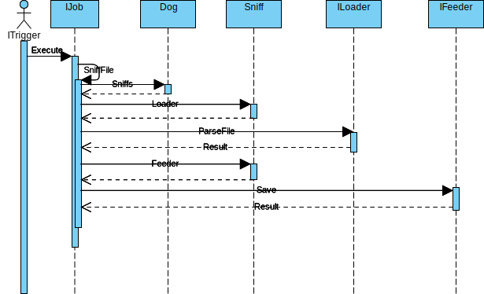

# PuppyMommy
WatchDog Platform.

## Structure
### Sequence Diagram


### Job
Control every job executing, dispatch Loader, Feeder.

### Loader
Parse file content to instance base on Common.FileResultBase.

``` csharp
        public ResultType ParseFile(string filePath, out FileResultBase fileResult)
        {
            //read file content...
            
            //parse file content to file result
            var fileResultDetail = new SimpleFileResult();

            fileResult = fileResultDetail;

            return ResultType.Fetch;
        }
```

### Feeder
According to Result of Loader, save result to anywhere.

multi type of FileResultBase
``` csharp
        private ResultType Save(NikonFileResult nikonFileResult)
        {
            if (nikonFileResult == null)
                return ResultType.None;

            //save content...

            return ResultType.Success;
        }
        private ResultType Save(SimpleFileResult simpleFileResult)
        {
            if (simpleFileResult == null)
                return ResultType.None;

            //save content...

            return ResultType.Success;
        }
```
then
``` csharp
            if (result == ResultType.None)
                result = Save(fileResult as SimpleFileResult);
            if (result == ResultType.None)
                result = Save(fileResult as NikonFileResult);

            if(result == ResultType.None)
                throw new Exception(string.Format("file result {0} is invalid", fileResult.GetType()));
```
